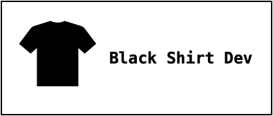

# **Hola, Soy Jose Valdebenito G**

## Desarrollador frontend

### Soy desarrollador frontend autodidacta.

Desde 2021 me encuentro aprendiento tecnologias web, comencé aprendiendo HTML, CSS, PYTHON.
Me encuentro en constante aprendizaje buscando una ruta en el desarrollo de software.

- En 2021 participé en un bootcamp auspiciado por Claro Chile, en el cual aprendí JAVA, con java swing y bases de datos relacionales con MySQL.
- En 2022 ingresé al programa ONE (Oracle Next Education)en conjunto con Alura Latam, en donde aprendí JavaScript y profundicé mis conocimientos en HTML y CSS.

Una vez egresado de ONE he continuado practicando y aprendiendo nuevas tecnologías.

---

## 👨🏻‍💻 Tecnologias

---

HTML
\| CSS 
\| Python 

FLASK

JavaScript

React

JAVA 

GIT 

Figma 

MySQL

mongoDB 

---

## 📫 Contactame

---

## 👨🏻‍💻 _*Mi portfolio*_: https://josevaldebenitog.github.io/PortafolioAlura/

## 📫 jvaldebenitog@me.com

<!---
JoseValdebenitoG/JoseValdebenitoG is a ✨ special ✨ repository because its `README.md` (this file) appears on your GitHub profile.
You can click the Preview link to take a look at your changes.
--->
