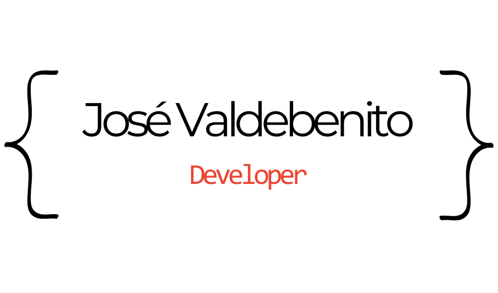

# **Hola, Soy Jose Valdebenito**

---

## 👨🏻‍💻 Desarrollador Web + iOS

### Soy desarrollador web autodidacta, en camino de mobile.

Desde 2021 me encuentro aprendiento tecnologias web, comencé aprendiendo HTML, CSS, PYTHON.
Me encuentro en constante aprendizaje buscando una ruta en el desarrollo de software.

- En 2021 participé en un bootcamp auspiciado por Claro Chile, en el cual aprendí JAVA, con java swing y bases de datos relacionales con MySQL.
- En 2022 ingresé al programa ONE (Oracle Next Education)en conjunto con Alura Latam, en donde aprendí JavaScript y profundicé mis conocimientos en HTML y CSS.

> [!IMPORTANT]
> Una vez egresado de ONE he continuado practicando y aprendiendo nuevas tecnologías.

---
- En 2024 he decidido orientarme hacia el desarrollo mobile y complementar mis conocimientos en web, comenzaré por aprender SWIFT para desarrollo para apps iOS.

### ‍💻 Tecnologías conocidas

 

 

---

### 📫 Contactame

<!---
JoseValdebenitoG/JoseValdebenitoG is a ✨ special ✨ repository because its `README.md` (this file) appears on your GitHub profile.
You can click the Preview link to take a look at your changes.
--->
